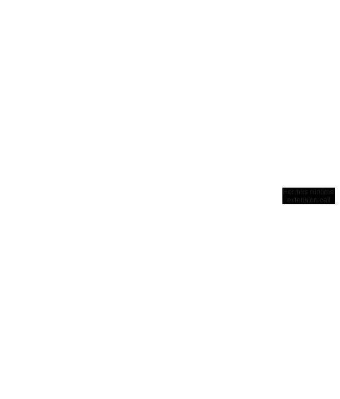

# Hermes core

*Hermes core* represents an event-driven system running on top of the WASM runtime utilizing [WASM component model](https://component-model.bytecodealliance.org/design/why-component-model.html) approach.
Every user's application is expected to be written as an implementation of an events handler and bundled into a WASM module, which means that it could be developed on any laguage with the WASM support e.g. Java, C, Rust, Go etc.

## Hermes runtime extension (HRE)

*Hermes runtime extension (HRE)* - a Hermes module which will provides an additional functionality to the *Hermes applications* and stands as a library.
It could produce a *Hermes events*, which can then be placed into the *Hermes events queue* for further processing by the applications.
Each *HRE* defines a specific [WIT](https://component-model.bytecodealliance.org/design/wit.html) file, with the described interface of *HRE calls* (directly by the *Hermes applications*) and specification of produced events.

## Hermes event

*Hermes event* - an event produced by *HRE* that encapsulates all the necessary data needed to process it.
After successful delivery, each event can be executed by the *Hermes application*, depending on whether that specific *Hermes application* has subscribed to such events or not.

## Hermes events queue

*Hermes events queue* - a queue-like data structure.
Events are added to one end, one by one, by the *HRE*.
The *Hermes applications* then executes/consumes these events from the other end of the queue.
The queue preserves the order of event execution based on how they were added in it.

## Hermes application

*Hermes application* - a collection of WASM components, which are packed together and
executes a specific business logic. It mainly serves as an event handler for the of the *Hermes Events*.
Each *Hermes application* can interact with the *HRE* through *HRE calls* based on corresponding [WIT](https://component-model.bytecodealliance.org/design/wit.html) definitions.