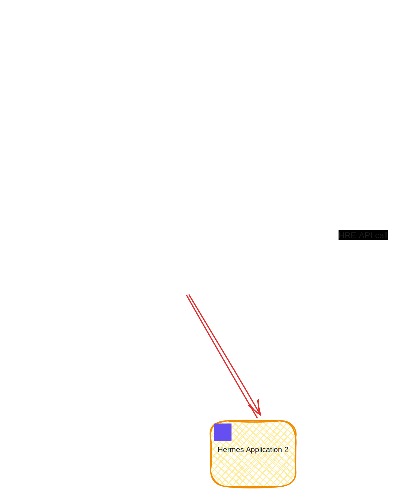

# Hermes engine

*Hermes engine* represents an event-driven system running on top of the WASM runtime utilizing
[WASM component model](https://component-model.bytecodealliance.org/design/why-component-model.html) approach.
Every user's application is expected to be compiled as a WASM component,
which means that it can be developed in any language with WASM Component Model support (e.g., Rust, C/C++, Go, etc.).

## Hermes runtime extension (HRE)

*Hermes runtime extension (HRE)* - a Hermes module
which will provides an additional functionality, besides to the [*Hermes application*] and stands as a library.
It is typically a singleton, which serves all [*Hermes applications*][*Hermes application*] at a time.
It defines the following parts:

* [*Hermes events*] (e.g., cron ticks, HTTP requests, IPFS messages, chain blocks).
* HRE API - WIT-defined types and host functions callable from WASM modules.
  
Specification of the [*Hermes events*] and *HRE api* defined in [WIT] files.

## Hermes event

*Hermes event* - an event produced and defined by [*HRE*] that encapsulates all the necessary data needed to process it.
After successful delivery, each event can be executed by a [*Hermes application*],
depending on whether that specific [*Hermes application*] has subscribed to such events or not.

## Hermes events queue

*Hermes events queue* - a queue-like data structure.
[*Hermes events*] are added to the one end, one by one, by the [*HRE*].
Applications then consume these events from the other end of the queue. The queue preserves the order of event execution per-source while allowing unrelated sources to proceed in parallel via a worker pool.

## WASM execution model

- Wasmtime Component Model with generated bindings from WIT definitions.
- Imports are linked once into a `wasmtime::InstancePre` to minimize per-call overhead.
- Every call runs with a fresh runtime context (app name, module ID, event name, execution counter, VFS handle).
- Module state remains immutable across calls, avoiding cross-call side effects.

## HTTP gateway

- Resolves application by hostname and routes `GET/POST/...` requests based on configured endpoint subscriptions or `/api` path.
- Serves static web content directly from the package VFS (e.g., HTML/CSS/JS).
- Forwards API requests to modules via events; responses returned to the client.

## IPFS/libp2p integration

- Embedded node bootstrapped on engine start (configurable default bootstraps).
- Pub/sub topics and DHT used for distributing structured, signed data and messages.
- Per-application tracking of topic subscriptions and pinned files.

## Hermes application

*Hermes application* - a collection of WASM components, which are packed together and executes a specific business logic.
It mainly serves as an event handler for the [*Hermes Events*].
Each *Hermes application* can interact with the [*HRE*] through the defined *HRE api* based on corresponding
[WIT] definitions.

[WIT]: https://component-model.bytecodealliance.org/design/wit.html
[*HRE*]: #hermes-runtime-extension-hre
[*Hermes Events*]: #hermes-event
[*Hermes application*]: #hermes-application
