# IPFS Document Sync Protocol — Specification (Draft)

## Status

* Stage: PoC draft

* Version: 0.1.0 (wire format frozen per this document; numeric parameters may be tuned)

## Overview

**Purpose:** Efficiently synchronize a set of document CIDs across peers using
  IPFS pub/sub broadcast for announcements and manifest-based set reconciliation for divergence.

**Design:** Append-only document set represented by a Sparse Merkle Tree (SMT) root.
  Three required pub/sub topics per set: `<base>.new`, `<base>.syn`, `<base>.dif`.
  Two optional topics for proofs: `<base>.prv` (proof requests) and `<base>.prf` (proof replies).

**Assumptions (PoC):** Honest peers, no privacy, all messages publicly readable.
  All payloads use deterministic CBOR encoding with strict framing.

### Diagram — High-level Sync Flow

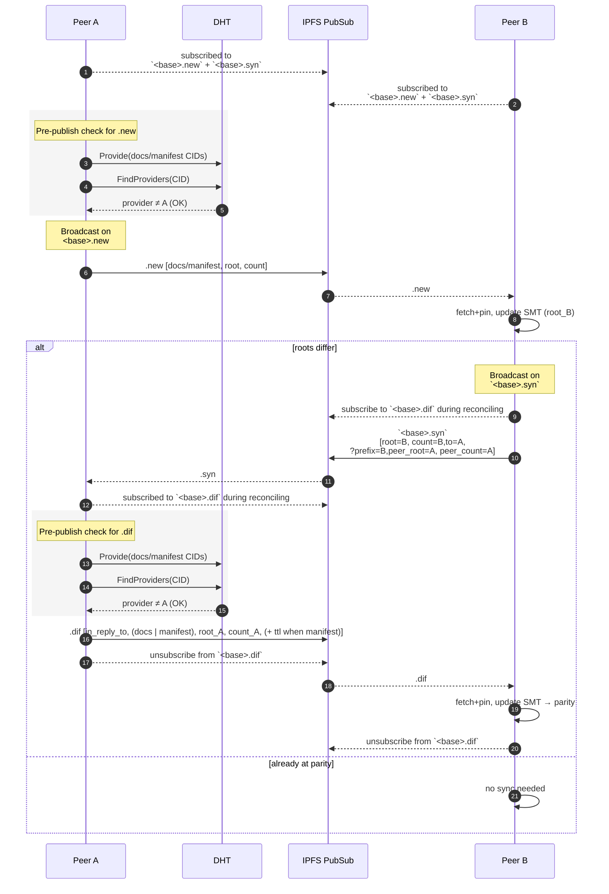

## Scope and Goals

* Ensure eventual consistency of document sets across honest peers.
* Minimize pub/sub bandwidth via batched announcements and manifest-based diffs.
* Idempotent processing of duplicates and replays.
* Generic over `<base>` topic names; multiple sets may run in parallel.

## Non-Goals

* Adversarial hardening (Sybil/DoS resistance, spam prevention).
* Confidentiality or payload encryption.
* Membership/admission control.

## Roles and Entities

* **Peer:** A participant with an IPFS/libp2p node publishing and subscribing to the three topics for a given `<base>`.

* **Set:** The document set scoped to `<base>`.

## Protocol Versioning and Negotiation

* Field `ver` within payloads carries protocol version (uint).
  This document defines `ver = 1`.

* Implementations MUST ignore unknown optional fields; unknown critical fields MUST cause rejection.

## Transport Bindings

**Pub/Sub:** libp2p gossipsub (via IPFS pubsub).
All messages are broadcasts on the following topic designations:

* `<base>.new` : announcements of new CIDs and the sender’s resulting root
* `<base>.syn` : synchronization solicitations for reconciliation
* `<base>.dif` : reconciliation replies with pointers to diff manifests or small inline lists
* `<base>.prv` : *OPTIONAL* requests for SMT inclusion proofs of specific CIDs
* `<base>.prf` : *OPTIONAL* proof replies containing SMT proofs

No direct streams are required in this PoC; all reconciliation occurs on pub/sub.
The broadcast nature of Pub/Sub is utilized to improve efficiency in the sync process by
allowing all peers to observe the sync processes and preemptively update.

### How multiple topics help the system scale

**Processing isolation:**

* `.new` is small and frequent (control-plane for appends),
* `.syn` is synchronization request control-only,
* `.dif` can be large or bursty, and
* `.prv/.prf` are occasional and ephemeral.
  Separating channels prevents heavy `.dif` traffic from delaying `.new` processing and keeps control paths fast.

**Gossipsub performance:** IPFS/libp2p maintains meshes, validation, and scoring per-topic.
  Splitting topics allows independent backpressure, scoring, and message ID de-dup caches,
  improving fairness and convergence under load.

**Selective subscription:** Peers can opt out of proof traffic entirely,
  or temporarily subscribe to `.prf` only when they request a proof,
  reducing baseline bandwidth and CPU.

**Policy and rate limits:** Enforce “one message kind per topic” and apply separate quotas/priorities.
  For example, prioritize `.new` over `.dif` so new content signals propagate quickly, while large diffs trickle.

**Observability:** Topic-level metrics and alarms make it easy to detect misconfiguration or abuse
  (e.g., oversized `.dif` bursts) and to tune thresholds per traffic class.

**Future extensions:** Per-topic admission or encryption can be added without impacting unrelated flows.

#### Diagram — Topic Separation and QoS

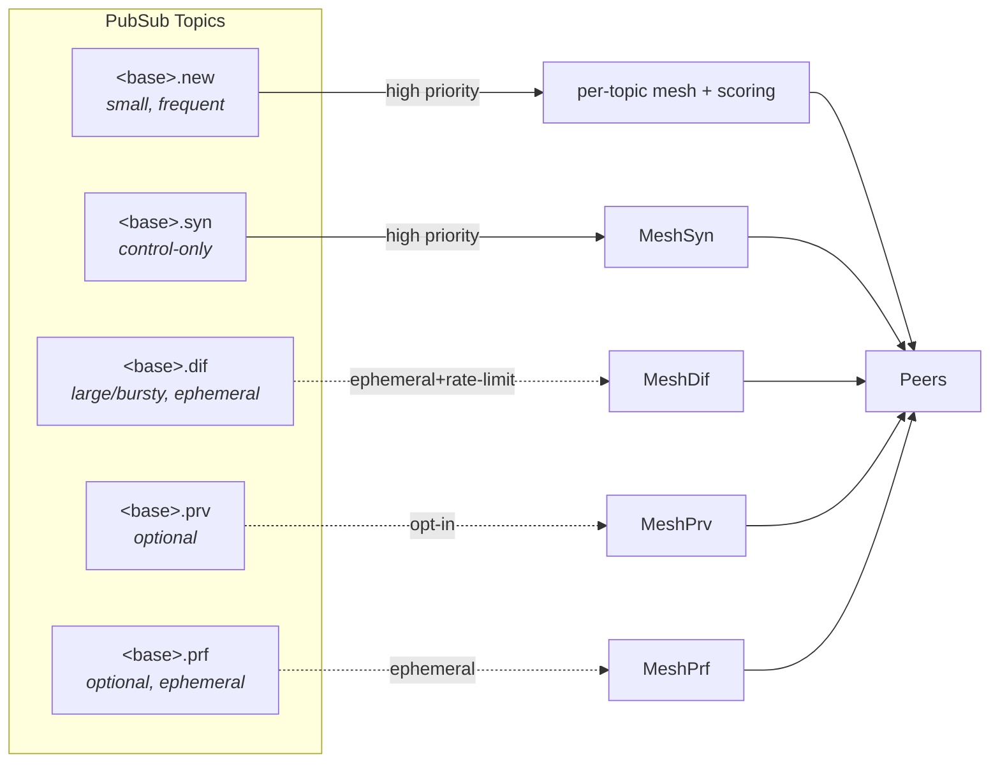

## Topics and Namespacing

`<base>` is an opaque UTF-8 string under 120 characters, defined by higher-level context.

Topic semantics are single-purpose: a topic MUST carry only its designated message type.
Peers MAY drop senders violating this.

*Proof topics are OPTIONAL.*
Topics that require verifiability SHOULD additionally subscribe to `<base>.prv` and `<base>.prf`.

### Sync Topic Subscription

* Peers SHOULD always subscribe to `<base>.new` and `<base>.syn`.
* Peers SHOULD subscribe to `<base>.dif` only while reconciling (Diverged/Reconciling states) and
  SHOULD unsubscribe when Stable to reduce baseline traffic.

#### Diagram — Subscribe/Unsubscribe During Sync

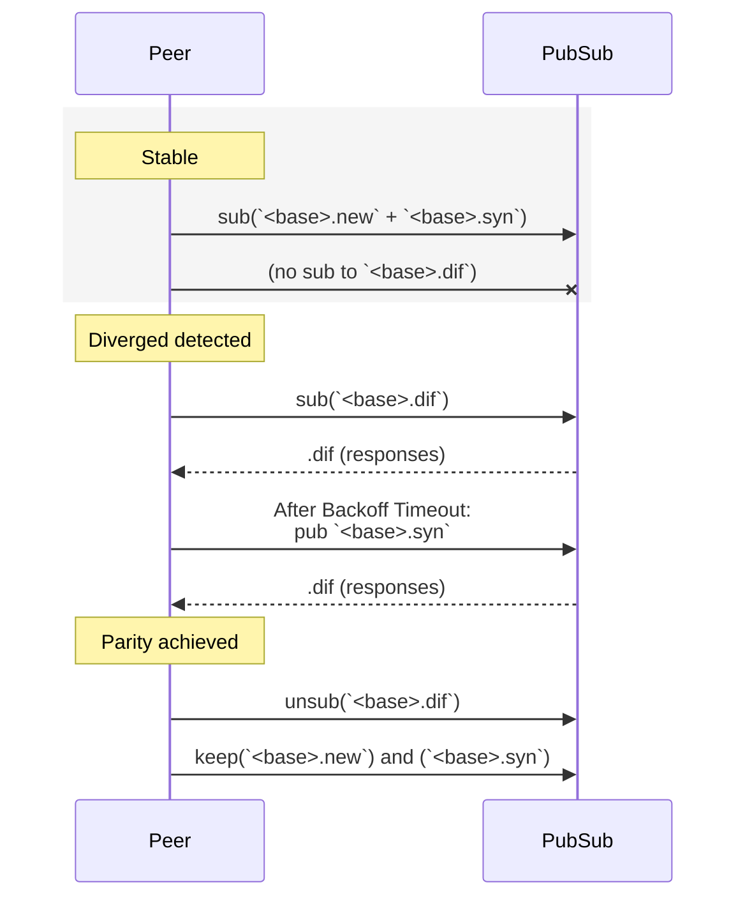

## Message Model
<!-- markdownlint-disable MD033 -->
Framing and Signature Envelope (matches the common envelope CDDL provided):

* Each message is a CBOR byte string (bstr) whose content is a CBOR array encoded deterministically:<br>
  `signed-payload = [ peer, seq, ver, payload, signature_bstr]`.
* Signature input: computed over the deterministic CBOR encoding of the array
  `[peer, seq, ver, payload]` (the signed payload without the signature field).
  The signed payload array is then wrapped in a bstr for framing, and `signature_bstr`
  contains the Ed25519 signature over that array’s bytes.
<!-- markdownlint-enable MD033 -->

**Rationale:** Outer bstr provides explicit length framing; deterministic CBOR ensures unambiguous signing.

**Deduplication:** Receivers MUST de-duplicate by `(peer-pubkey, seq)` and drop duplicates.

**Idempotence:** Duplicated CIDs in `.new` are harmless; set inserts are idempotent.

### Envelope Field Definitions

1. **peer** - The Ed25519 Public Key which matches the senders Peer ID in the IPFS Network.
  The sender’s peer ID can be derived from this public key, and MUST be valid.
2. **seq** - Message Sequence.
   A UUIDv7 that defined both a unique Nonce, and a Timestamp.
   Prevents and helps detect message duplication.
3. **ver** - Numeric protocol version.
   This protocol is Version 1, so this will be encoded as `1`.
4. **payload** - The channel specific payload contained within the message.
5. **signature** - The signature over all preceding bytes, from the bstr header to the end of the payload.
   The signature is made using the senders private ED25519 key which matches their public key.
   It is validated against the **peer** field at the start of the payload.

### Diagram — Envelope and Payload

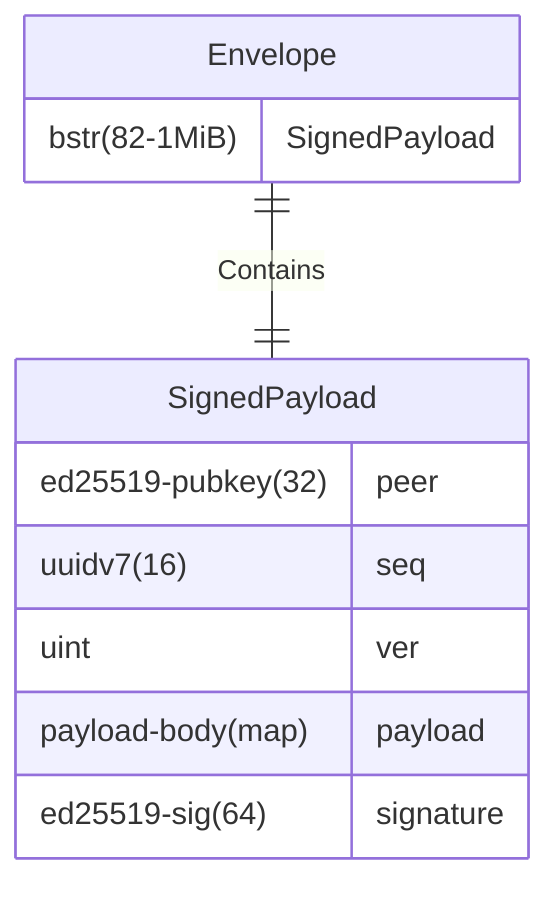

### Common Message Envelope

```cddl
; Common Message Envelope

; Envelope: outer bstr containing a signed CBOR payload
envelope = bstr .size (82..1048576) .cbor signed-payload

signed-payload = [ 
    peer: peer-pubkey,
    seq: uuidv7,
    ver: uint,
    payload: payload-body, 
    signature_bstr: peer-sig 
]

uuidv7 = uuid
uuid = #6.37(bytes .size 16)

ed25519-pubkey = bytes .size 32
ed25519-sig = bytes .size 64

peer-pubkey = ed25519-pubkey
peer-sig = ed25519-sig

payload-body = { * uint => any }
```

### Diagnostic example (envelope framing only)

```cbor
bstr([
  h'aa..peer-pubkey..',   ; peer (ed25519 pubkey)
  h'01..uuidv7..',        ; seq
  1,                      ; ver = 1
  { 1: h'root..', 2: 42 },; payload-body (example for .new)
  h'..signature..'        ; peer-sig
])
```

## Message Types

### Document Dissemination (shared payload for `.new` and `.dif`)

This generic message describes the common payload-body used by both `.new` and `.dif`.

Topic-specific rules (e.g., `.dif` requiring `in_reply_to`, `.new` forbidding it) are defined in their respective sections below.

**Semantics:** Announce documents and the sender’s resulting set summary.

Payload-body Keys:
<!--markdownlint-disable MD033-->

| Index | Name | Type | Description |
| --- | --- | --- | --- |
| 1 | **root** | root-hash | BLAKE3-256 of the sender’s SMT root |
| 2 | **count** | uint | sender’s current document count |
| 3 | **docs**  | array of cidv1<br>*OPTIONAL* | inline CIDs the sender believes others may be missing (≤ 1 MiB total) |
| 4 | **manifest** | cidv1<br>*OPTIONAL* | manifest CID listing CIDs when message size would exceed 1 MiB. |
| 5 | **ttl** | uint<br>REQUIRED with manifest | seconds the manifest remains available.<br>The responder MUST keep the manifest block available for at least this time.<br>Present only when `manifest` is used; absent otherwise. |
| 6 | **in_reply_to** | UUIDv7 | `seq` of the `.syn` message which caused this message to be sent. (Not used in `.new`) |

<!--markdownlint-enable MD033-->
Either **docs** or **manifest** MUST be present, and only one of them may be present.

#### Document dissemination payload-body

```cddl

; Payload body fits within the Common Message Envelope
payload-body = doc-dissemination-body

; numeric keys (shared by .new and .dif)
root = 1
count = 2
docs = 3
manifest = 4
ttl = 5
in_reply_to = 6

common-fields = (
    root => root-hash,     ; Root of the senders SMT with these docs added.
    count => uint,         ; Count of the number of docs in the senders Merkle Tree.
    ? in_reply_to => uuid, ; Included if this is a reply to a `.syn` topic message.
)

doc-dissemination-body = ({
    common-fields,        ; All fields common to doc lists or doc manifests
    docs => [* cidv1]     ; List of CIDv1 Documents 
} / {
    common-fields,        ; All fields common to doc lists or doc manifests
    manifest => cidv1,    ; CIDv1 of a Manifest of Documents 
    ttl => uint           ; How long the Manifest can be expected to be pinned by the sender.
})

; self-contained types
blake3-256 = bytes .size 32 ; BLAKE3-256 output
root-hash = blake3-256      ; Root hash of the Sparse Merkle Tree
uuid = #6.37(bytes .size 16) ; UUIDv7

; IPLD content identifier.
; Currently limited to SHA2-256 based CIDs.
cidv1 = #6.42(bytes .abnfb ("cid" .det cbor-cid ))

; CIDv1 ABNF Constrained for SHA2-256
cbor-cid = '
    cid = cidv1 codec-cbor sha2-256 digest-32 digest
    cidv1 = %x00 %x01
    codec-cbor = %x51
    sha2-256 = %x12
    digest-32 = %x20
    digest = 32(%x00-FF)
'
```

**Note:** *Only CIDv1 with multihash sha2-256 is permitted for document CIDs in this PoC;
implementations MUST reject other multihash functions.*

##### CIDv1 binary encoding (PoC focus)

Layout (packed bytes): `cidv1 = varint(1) || varint(multicodec) || multihash`.

Multihash for this PoC MUST be sha2-256 with a 32-byte digest:

`multihash = varint(0x12) || varint(32) || digest[32]`.

Length varies slightly (36..40 bytes) due to varint encoding of the multicodec field.

Other multihash functions are Invalid.

###### References

* CIDv1 specification: <https://github.com/multiformats/cid>
* Multicodec table: <https://github.com/multiformats/multicodec>
* Multihash specification: <https://github.com/multiformats/multihash>

##### Pre publication document availability check

Pre-publication availability check **(MUST)** be performed before announcing or referencing a document CID on the network
(i.e., publishing a payload on `.new`, `.dif`, or `.prv` that contains a `cidv1` either inline or via a manifest),
the publishing peer MUST ensure the CID is discoverable via the DHT by:

1. Providing the CID (announce provider records) to the DHT, and
2. Successfully calling FindProviders(CID) and obtaining at least one provider peer ID that is NOT the publisher’s own peer ID.

If this check fails, the publisher MUST retry Provide/FindProviders with backoff before sending the announcement.
For manifests, this requirement applies to the manifest CID itself and to every CID listed within the manifest.

Rationale: This ensures receiving peers can discover and fetch/pin the referenced content promptly after observing the announcement.

##### Diagram — Choosing docs vs manifest

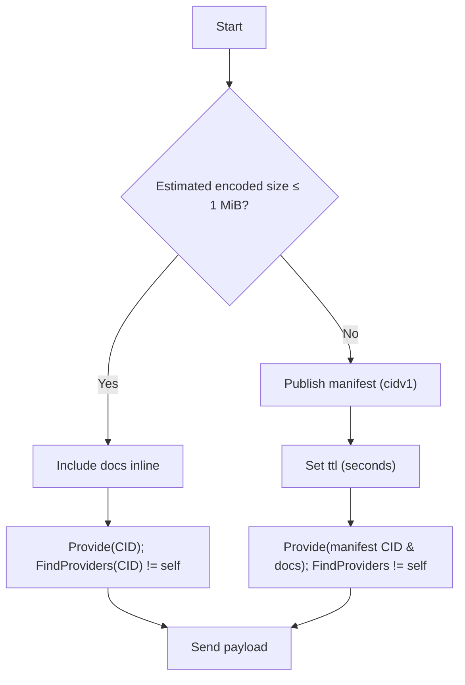

#### Diagnostic example (payload-body decoded)

```cbor
{ 
    1: h'aaaa...aaaa', 
    2: 100, 
    3: [ 
        h'01..cidv1', 
        h'02..cidv1' 
    ] 
}
```

### `.new` (topic `<base>.new`)

**Semantics:** Announce newly produced documents and proactively disseminate documents the sender believes others may be missing.

**Payload-body:** Uses the shared Document Dissemination payload (see “Document Dissemination”).

**Topic rules:**

* *in_reply_to* MUST NOT be present on `.new`.
* **docs** or **manifest** MUST be present (exactly one of them).
  For `.new` keepalive re‑announcements (see below),
  **docs** MAY be an empty array to re‑advertise the sender’s current
  `root` and `count` without pointing to any documents.
* **ttl** MUST be present when `manifest` is used and MUST NOT appear with inline `docs`.
  Individual announced `docs` are always pinned.

**Processing:**

1. *Publisher precondition (MUST):* Prior to publishing a `.new` with any `cidv1` (inline or via manifest),
   the publisher MUST ensure each CID is discoverable via the DHT by calling Provide(CID) and then
   FindProviders(CID) and receiving at least one provider peer ID that is not the publisher’s own.
   If not satisfied, retry with backoff before publishing.
   When a manifest is used, this applies to the manifest CID itself and to every CID listed within the manifest.
2. *Document validation:* Fetch and pin all CIDs from docs or manifest before insertion.
3. *Atomic pinning:* if any CID cannot be fetched and pinned within the pinning retry window,
   release partial pins and defer insertion.
4. *Recompute SMT root:* Upon successful pin of all CIDs, insert each CID into the local SMT; compute local root.
5. *Verify convergence:* If local root ≠ sender root, mark divergence and enter reconciliation backoff (see State Machines),
   unless parity is achieved during backoff via subsequent `.new`/`.dif` reception.

#### Quiet‑period re‑announce (keepalive on `.new`)

To ensure peers can detect divergence even in prolonged steady state (no new documents),
each peer maintains a per‑channel quiet‑period timer.

If no `.new` messages are observed on `<base>.new` for the duration of this timer (with added jitter), the peer SHOULD publish a
`.new` whose **docs** field is present but empty (i.e., `[]`).

This keepalive:

* re‑advertises the sender’s current `root` and `count` without referencing any CIDs,
* requires no DHT pre‑publication checks or pinning (no CIDs are announced), and
* enables other peers to observe root mismatches and enter reconciliation.

Peers MUST apply jitter to avoid synchronized bursts and SHOULD
rate‑limit keepalives (see Timers and Retries).

##### Diagram — Quiet‑period `.new` keepalive triggers reconciliation (2 peers)

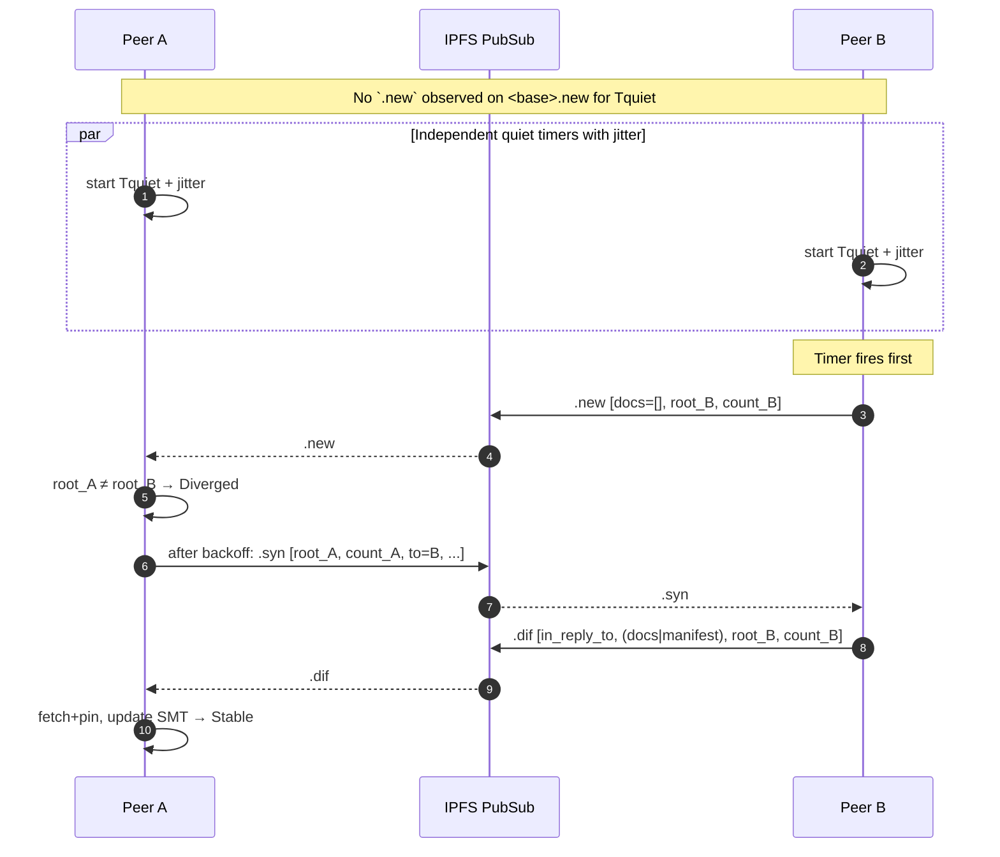

### .syn (topic `<base>.syn`)

**Semantics:** Solicitation for reconciliation; requests a diff from peers.

**Payload-body Keys:**
<!--markdownlint-disable MD033-->

| Index | Name | Type | Description |
| --- | --- | --- | --- |
| 1 | **root** | root-hash | BLAKE3-256 of the requester’s SMT root |
| 2 | **count** | uint | requester’s current document count |
| 3 | **to**   | peer-pubkey | target peer to respond (required; hint only — other peers MAY reply) |
| 4 | **prefix**  | array of prefix-hash<br>*OPTIONAL* | SMT node hashes at depth $D$, left-to-right across the tree.<br>Array length MUST be a power of two (2,4,8,…,16384). Include only when count > 64. |
| 5 | **peer_root** | root-hash | last observed SMT root of the target peer (as believed by requester) |
| 6 | **peer_count** | uint | last observed document count of the target peer (as believed by requester) |

<!--markdownlint-enable MD033-->
**Processing:**

* Any peer MAY respond if it believes it can help reconcile;
  responders SHOULD use jitter (see Timers) and suppress if a suitable `.dif` appears.
* Observers MAY use information to converge opportunistically,
  but `.syn` does not carry updates itself.

#### Determining the number of **prefix** entries in the message

If there are ≤ 64 documents in the tree being solicited, then there are no **prefix** entries (the root suffices).
If there are > 64, include a **prefix** array of length $2^D$, where $D \ge 1$.

Target bucket size is ~64 documents.
When total docs $N$ passes $64\cdot 2^D$, increase depth to $D+1$ so the new average bucket size becomes $\approx N/2^{D+1}$
(about half the previous, trending back toward 64 as documents grow).
This produces a stable oscillation between ~32 and ~64 per bucket and keeps reconciliation overhead predictable.

**Prefix Entries:**

Prefix entries are the SMT node hashes (NodeHash(left,right) with BLAKE3-256) at depth D across the tree from left to right
(hence a power-of-two count).
Each increment of D doubles the number of prefix hashes.
For message-size constraints, D MUST NOT exceed 14 (max 16384 entries); deeper arrays risk exceeding the 1 MiB limit.

Note: Prefix hashes are computed over the requester’s own SMT at depth $D$;
responders compare these against their corresponding nodes to locate mismatches.

#### Prefix-depth selection for bucketization

Depth $d$ is chosen based on the requester’s estimate of the responder’s document count $N$ (**peer_count**),
targeting $\le 64$ items per bucket until a maximum depth is reached:

1. Compute $d_{\mathrm{req}} = \left\lceil \log_2\!\left(\max(1, N / 64)\right) \right\rceil$.
2. Set $d = \min\big(14,\; \max(1,\, d_{\mathrm{req}})\big)$.

The **prefix** array then contains the $2^d$ SMT node hashes at depth $d$ (left→right).
Responders infer $d$ from the array length.

#### Diagram — Sparse Merkle Tree Depth and Headers

The `.syn` message includes a prefix array of node hashes at depth `d` (the “headers”) to partition the tree into `2^d` buckets.
Each prefix entry is the SMT node hash `NodeHash(left, right)` at depth `d` (BLAKE3-256), ordered left-to-right across the tree.
Responders compare these headers against their own nodes at the same depth to find mismatching buckets and
then return all documents under those buckets via `.dif`.

```dot
digraph SMT {
  rankdir=TB;
  splines=true;
  nodesep=0.4;
  ranksep=0.5;

  node [shape=circle, fontsize=8, width=0.6, height=0.6, fixedsize=true];

  // Depth 0 (root)
  root [label="Root\n(depth 0)", shape=doublecircle, style=filled, fillcolor="#eef6ff"];

  // Depth 1
  d1L [label="d=1:L"]; 
  d1R [label="d=1:R"];

  // Depth 2 (headers at d=2)
  // These are the prefix nodes included in .syn when d=2
  node [shape=circle, style="filled,bold", fillcolor="#fff4ce", color="#e0a800", fontsize=8, width=0.6, height=0.6, fixedsize=true];
  h0 [label="H0\n(depth 2)"]; 
  h1 [label="H1\n(depth 2)"]; 
  h2 [label="H2\n(depth 2)"]; 
  h3 [label="H3\n(depth 2)"];

  // Restore default style for leaves
  node [shape=oval, style=solid, fillcolor=white, color=black, fontsize=8, width=0.7, height=0.45, fixedsize=true];

  // Depth 256 (example leaves under each header)
  l0 [label="doc A\n(depth 256)"];
  l0r [label="(empty)\n(depth 256)", style=dashed];

  l1l [label="(empty)\n(depth 256)", style=dashed];
  l1 [label="doc B\n(depth 256)"];

  l2 [label="doc C\n(depth 256)"]; 
  l2r [label="(empty)\n(depth 256)", style=dashed];

  l3 [label="(empty)\n(depth 256)", style=dashed];
  l3r [label="(empty)\n(depth 256)", style=dashed];

  l4 [label="doc D\n(depth 256)"]; 
  l4r [label="doc E\n(depth 256)"]; 

  l5 [label="(empty)\n(depth 256)", style=dashed];
  l5r [label="(empty)\n(depth 256)", style=dashed];

  l6r [label="doc E\n(depth 256)"];
  l6 [label="doc F\n(depth 256)"]; 

  l7 [label="doc G\n(depth 256)"];
  l7r [label="doc H\n(depth 256)"];

  // Edges
  root -> d1L; root -> d1R;
  d1L -> h0; d1L -> h1; d1R -> h2; d1R -> h3;

  // Discontinuity: depth 3..255 omitted (ellipses per bucket)
  node [shape=plaintext, fontsize=9];
  e0 [label="…\n(depth 3..255)", color="#9ca3af"];
  e1 [label="…\n(depth 3..255)", color="#9ca3af"];
  e2 [label="…\n(depth 3..255)", color="#9ca3af"];
  e3 [label="…\n(depth 3..255)", color="#9ca3af"];
  e0r [label="…\n(depth 3..255)", color="#9ca3af"];
  e1r [label="…\n(depth 3..255)", color="#9ca3af"];
  e2r [label="…\n(depth 3..255)", color="#9ca3af"];
  e3r [label="…\n(depth 3..255)", color="#9ca3af"];

  // Connect headers to ellipses and to leaves
  h0 -> e0 [style=dotted, color="#9ca3af"]; 
  h0 -> e0r [style=dotted, color="#9ca3af"]; 
  h1 -> e1 [style=dotted, color="#9ca3af"]; 
  h1 -> e1r [style=dotted, color="#9ca3af"]; 
  h2 -> e2 [style=dotted, color="#9ca3af"]; 
  h2 -> e2r [style=dotted, color="#9ca3af"]; 
  h3 -> e3 [style=dotted, color="#9ca3af"];
  h3 -> e3r [style=dotted, color="#9ca3af"];

  e0 -> l0 [style=dotted, color="#9ca3af"]; 
  e0 -> l0r [style=dotted, color="#9ca3af"]; 
  e0r -> l1l [style=dotted, color="#9ca3af"];
  e0r -> l1 [style=dotted, color="#9ca3af"];

  e1 -> l2 [style=dotted, color="#9ca3af"]; 
  e1 -> l2r [style=dotted, color="#9ca3af"]; 
  e1r -> l3 [style=dotted, color="#9ca3af"];
  e1r -> l3r [style=dotted, color="#9ca3af"];

  e2 -> l4 [style=dotted, color="#9ca3af"]; 
  e2 -> l4r [style=dotted, color="#9ca3af"]; 
  e2r -> l5 [style=dotted, color="#9ca3af"]; 
  e2r -> l5r [style=dotted, color="#9ca3af"]; 

  e3 -> l6r [style=dotted, color="#9ca3af"];
  e3 -> l6 [style=dotted, color="#9ca3af"]; 
  e3r -> l7 [style=dotted, color="#9ca3af"];
  e3r -> l7r [style=dotted, color="#9ca3af"];

  // Ranks to visualize depth layers
  {rank=same; root}
  {rank=same; d1L; d1R}
  {rank=same; h0; h1; h2; h3}
  {rank=same; e0; e1; e2; e3}
  {rank=same; l0; l1; l2; l3; l4; l5; l6; l7}
}
```

#### CDDL — `.syn` payload-body

```cddl
; Payload body fits within the Common Message Envelope
payload-body = msg-syn

; numeric keys
root = 1
count = 2
to = 3
prefix = 4
peer_root = 5
peer_count = 6

msg-syn = {
  root => root-hash,
  count => uint,
  to => peer-pubkey,
  ? prefix => prefix-array,
  peer_root => root-hash,
  peer_count => uint
}

prefix-array =
    [ 2*2 prefix-hash ]
  / [ 4*4 prefix-hash ]
  / [ 8*8 prefix-hash ]
  / [ 16*16 prefix-hash ]
  / [ 32*32 prefix-hash ]
  / [ 64*64 prefix-hash ]
  / [ 128*128 prefix-hash ]
  / [ 256*256 prefix-hash ]
  / [ 512*512 prefix-hash ]
  / [ 1024*1024 prefix-hash ]
  / [ 2048*2048 prefix-hash ]
  / [ 4096*4096 prefix-hash ]
  / [ 8192*8192 prefix-hash ]
  / [ 16384*16384 prefix-hash ]

; self-contained types
blake3-256 = bytes .size 32 ; BLAKE3-256 output
root-hash = blake3-256      ; Root hash of the Sparse Merkle Tree
prefix-hash = blake3-256    ; Node hash at depth D (prefix bucket) of the SMT
ed25519-pubkey = bytes .size 32
peer-pubkey = ed25519-pubkey
```

Diagnostic example (payload-body decoded):

```cbor
{ 
  1: h'aaaa...aaaa', 
  2: 100, 
  3: h'cafebabe' 
}
```

Diagram — Sync Handshake

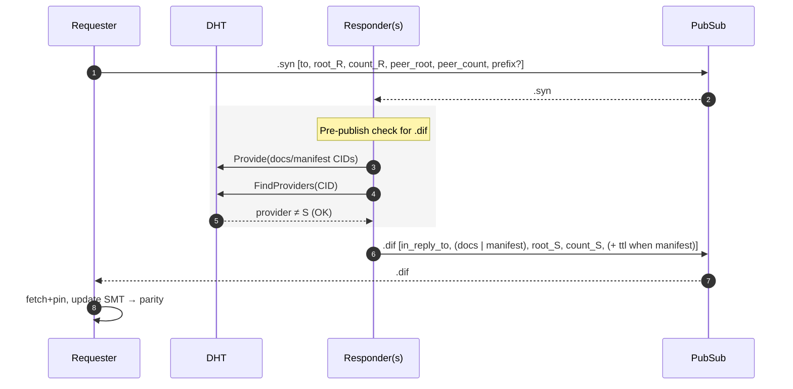

### .dif (topic `<base>.dif`)

**Semantics:**

The Reconciliation reply.
Carries the same Document Dissemination payload as `.new`, but is sent specifically in response to a `.syn`.

**Payload-body:**

Uses the shared Document Dissemination payload (see “Document Dissemination”).

**Topic rules:**

* **in_reply_to** MUST be present and MUST reference the `.syn` being answered (its envelope seq).
* **docs** or **manifest** MUST be present (exactly one of them).
* **ttl** MUST be present when **manifest** is used; responders MUST keep manifest blocks available for at least ttl seconds.

Responders infer the requested depth $d$ from the length of the `.syn` prefix array
($2^d$) and reply with ALL documents that mismatch under that partitioning.
On reception, the requesting peer will ignore any documents it already has and only apply missing documents.
Sending all documents in a bucket ensures rapid convergence for all peers in the network.

**Processing:**

Prior to publishing a `.dif` with any `cidv1` (inline or via manifest),
the responder MUST ensure each CID is discoverable via the DHT by calling Provide(CID) and then
FindProviders(CID) and receiving at least one provider peer ID that is not the responder’s own.

If not satisfied, retry with backoff before publishing.
When a manifest is used, this applies to the manifest CID itself and to every CID listed within the manifest.

* Requesters fetch+pin any CIDs listed inline or in the diff manifest, update SMT, and check parity.
* Observers MAY also use `.dif` to converge faster.

### .prv (topic `<base>.prv`, OPTIONAL)

**Semantics:**

Request SMT inclusion proof(s) for a specific CID from one or more peers.

**Payload-body Keys:**

| Index | Name | Type | Description |
| --- | --- | --- | --- |
| 1 | **cid** | cidv1 | the document CID requested |
| 2 | **hpke_pkR** | bytes .size 32 | requester’s ephemeral X25519 public key (REQUIRED) |
| 3 | **provers** | array of peer-pubkey | OPTIONAL — explicit peers asked to respond |

Precondition (MUST): Before publishing `.prv` that references `cid`, the requester MUST ensure
FindProviders(cid) returns at least one provider peer ID that is not the requester’s own; otherwise retry with backoff.
This avoids soliciting proofs for undiscoverable content.

#### .prv Processing

* If `provers` is present, only listed peers SHOULD answer; others SHOULD ignore.
* If `provers` is absent, ALL enrolled provers that are subscribed to `<base>.prv` SHOULD reply (after normal jitter).
  Peers that are not provers (e.g., nodes that temporarily subscribe only to issue a request) MUST NOT reply.
* Responders DO NOT suppress based on other `.prf` replies (multiple independent proofs are acceptable).
* `.prv` carries no updates by itself.

#### CDDL — `.prv` payload-body

```cddl
; Payload body fits within the Common Message Envelope
payload-body = msg-prv

; numeric keys
cid = 1
hpke_pkR = 2
provers = 3

msg-prv = {
  cid => cidv1,
  hpke_pkR => x25519-pubkey
  ? provers => [* peer-pubkey],
}

; self-contained types
x25519-pubkey = bytes .size 32
ed25519-pubkey = bytes .size 32
peer-pubkey = ed25519-pubkey

; IPLD content identifier.
; Currently limited to SHA2-256 based CIDs.
cidv1 = #6.42(bytes .abnfb ("cid" .det cbor-cid ))

; CIDv1 ABNF Constrained for SHA2-256
cbor-cid = '
    cid = cidv1 codec-cbor sha2-256 digest-32 digest
    cidv1 = %x00 %x01
    codec-cbor = %x51
    sha2-256 = %x12
    digest-32 = %x20
    digest = 32(%x00-FF)
'
```

#### Diagnostic example (payload-body decoded)

```cbor
{ 
  1: h'05e8...cidv1', 
  2: h'5566...',
  3: [ h'aa11bb22', h'cc33dd44' ]
}
```

### .prf (topic `<base>.prf`, OPTIONAL)

**Semantics:** Reply to a `.prv` with an SMT inclusion proof for the requested `cid`.

**Payload-body Keys (outer, unencrypted):**

| Index | Name | Type | Description |
| --- | --- | --- | --- |
| 1 | **in_reply_to** | uuid | UUIDv7 of the `.prv` being answered |
| 2 | **hpke_enc** | bytes .size 32 | responder’s HPKE encapsulated ephemeral public key (REQUIRED) |
| 3 | **ct** | bytes | HPKE ciphertext of the proof payload (REQUIRED) |

**Encrypted plaintext fields (see `prf-plaintext` CDDL):**

| Index | Name | Type | Description |
| --- | --- | --- | --- |
| 1 | **kt-responder** | peer-pubkey | MUST equal the envelope peer-pubkey |
| 2 | **kt-in_reply_to** | uuid | MUST equal the outer in_reply_to and match the referenced `.prv` seq |
| 3 | **kt-cid** | cidv1 | MUST equal the requested `cid` from the `.prv` |
| 4 | **kt-root** | root-hash | SMT root the proof is about |
| 5 | **kt-count** | uint | Document count at that root |
| 6 | **kt-present** | bool | Whether the CID is included |
| 7 | **kt-proof** | smt-proof | Inclusion/non-inclusion proof |

**Processing:**

* Only the requester possessing the matching X25519 private key can decrypt `ct`.
* After decryption, verify bindings and the SMT proof; see Encrypted Proofs.
* Non-requesters cannot decrypt and SHOULD ignore the ciphertext.

#### CDDL — `.prf` payload-body and encrypted plaintext

```cddl
payload-body = msg-prf

; numeric keys (1-based)
in_reply_to = 1
hpke_enc = 2
ct = 3

msg-prf = {
  in_reply_to => uuid,         ; .prv being replied to
  hpke_enc => x25519-pubkey,   ; public X25519 key required for requester to read `ct`
  ct => bytes                  ; HPKE ciphertext of prf-plaintext
}

; self-contained types
blake3-256 = bytes .size 32 ; BLAKE3-256 output
root-hash = blake3-256      ; Root hash of the Sparse Merkle Tree
prefix-hash = blake3-256    ; Node hash at depth D (prefix bucket) of the SMT
ed25519-pubkey = bytes .size 32
peer-pubkey = ed25519-pubkey
uuid = #6.37(bytes .size 16) ; UUIDv7
x25519-pubkey = bytes .size 32

; IPLD content identifier.
; Currently limited to SHA2-256 based CIDs.
cidv1 = #6.42(bytes .abnfb ("cid" .det cbor-cid ))

; CIDv1 ABNF Constrained for SHA2-256
cbor-cid = '
    cid = cidv1 codec-cbor sha2-256 digest-32 digest
    cidv1 = %x00 %x01
    codec-cbor = %x51
    sha2-256 = %x12
    digest-32 = %x20
    digest = 32(%x00-FF)
'


; prf-plaintext (encrypted inside ct)
; numeric keys for prf-plaintext
kt-responder = 1
kt-in_reply_to = 2
kt-cid = 3
kt-root = 4
kt-count = 5
kt-present = 6
kt-proof = 7

prf-plaintext = {
  kt-responder => peer-pubkey, ; MUST equal envelope peer
  kt-in_reply_to => uuid,      ; MUST equal outer in_reply_to
  kt-cid => cidv1,             ; MUST equal requested cid from .prv
  kt-root => root-hash,
  kt-count => uint,
  kt-present => bool,
  kt-proof => smt-proof
}

; smt-proof key constants (see SMT Proof Encoding)

```

Diagnostic example (payload-body decoded):

```cbor
{ 
  1: h'018f0f92c3f8a9b2c7d1112233445570',  ; in_reply_to (uuidv7)
  2: h'1122...33',                          ; hpke_enc (X25519 encapsulated pubkey)
  3: h'99aa...ff'                           ; ct (ciphertext)
}
```

## Proof Topics Usage Model (Optional)

**Roles:**

* Proven storage peers: nodes that commit to answering proof requests.
* Non-proven peers: nodes that generally do not generate proofs but may occasionally request them.

**Recommended subscription pattern:**

* Proven storage peers SHOULD remain subscribed to `<base>.prv` only.
  Upon receiving a `.prv` they intend to answer, they SHOULD:
    1. temporarily subscribe to `<base>.prf`
    2. apply responder jitter
    3. publish their `.prf`, and
    4. promptly unsubscribe.
    5. They DO NOT suppress due to other `.prf` replies; proofs are tied to the responder’s storage commitment.
* Non-proven peers SHOULD remain unsubscribed from proof topics under normal operation.  
  When a proof is needed:
    1. Subscribe to `<base>.prv` and `<base>.prf`.
    2. Publish `.prv` specifying the `cid` (and optionally specific `provers`) and include `hpke_pkR` (ephemeral X25519 public key).
    3. Wait for `.prf` replies, decrypt, verify, and cache as needed.
    4. Unsubscribe from `<base>.prf` (and `<base>.prv` if no further requests).

**Rationale:** This pattern effectively narrows `.prf` delivery to the requester and the responding
  prover(s) currently subscribed, approximating point-to-point behavior over pub/sub and reducing
  background load for nodes that do not need proofs.

## State Machines

**Local peer maintains per-remote-peer sync state for each `<base>`:**

* Stable: local root equals last known root for all known peers.
* Diverged: a mismatch exists (local root ≠ any seen remote root).
  On entering Diverged, start backoff timer.
* Reconciling: after backoff expiry, publish `.syn`; await suitable `.dif` and apply.
* Parity achieved: upon local root matching the responder’s advertised root; return to Stable.

**Transitions may be triggered by `.new` or `.dif` arriving during backoff; if parity is reached, abort solicitation.**

### Diagram — Peer Sync State Machine (per `<base>`)

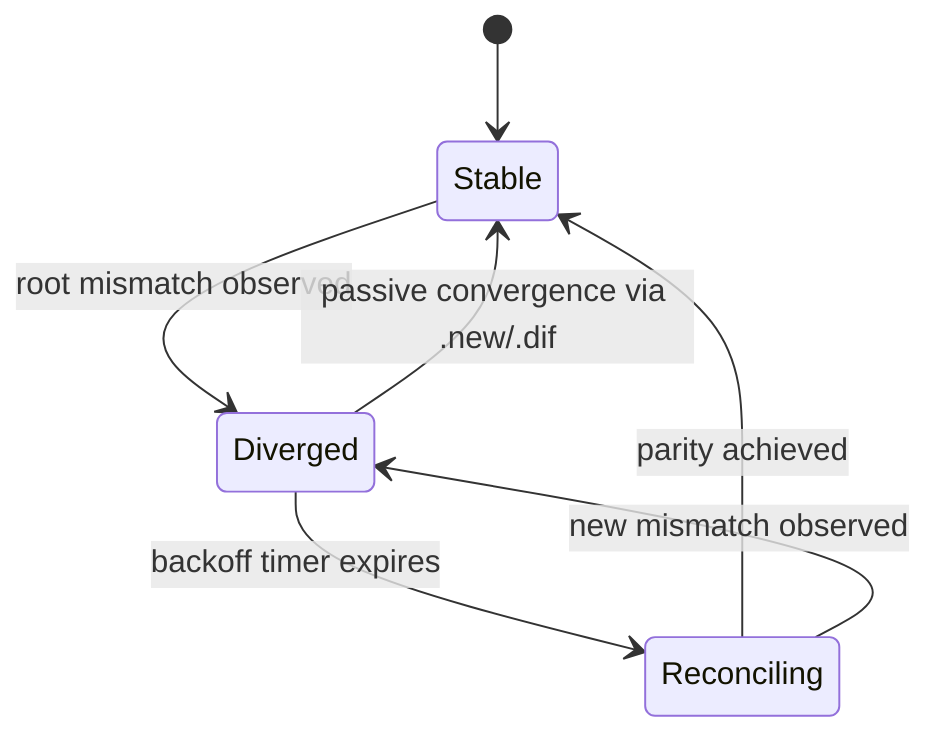

## Timers and Retries

* **Backoff/jitter before sending `.syn`:** uniform random in `[Tmin, Tmax]`
  (implementation-configurable; PoC suggestion: 200–800 ms).
* **Responder jitter before publishing `.dif`:** uniform random in `[Rmin, Rmax]`
  (PoC suggestion: 50–250 ms).
  Cancel if an adequate `.dif` appears.
* **Quiet‑period re‑announce on `.new`:** per‑channel quiet timer with jitter.
  If no `.new` is observed on `<base>.new` within `Tquiet`, publish a `.new` keepalive with `docs=[]`
  (empty) carrying only `root` and `count`.
    * Suggested PoC values: `Tquiet` uniformly random in [20 s, 60 s].
      Implementations SHOULD reset the timer upon receiving any `.new` on the channel and SHOULD rate‑limit
      to avoid sending more than one keepalive per `Tquiet` interval.
    * Rationale: enables divergence detection and reconciliation liveness in steady state without new content.
* **Diff manifest TTL:** responders SHOULD keep diff manifest blocks available for at least the announced `ttl`.
  The `ttl` field MUST be included in `.dif` when a `manifest` is used.
* **Pinning retry window:** implementations SHOULD configure a bounded retry window `Wpin`
  (e.g., tens of seconds) during which failed CID fetches from a single `.new` announcement are retried;
  if the window elapses without all CIDs pinned, release partial pins and schedule a later retry per node policy.
* **Proof reply jitter:** responders to `.prv` SHOULD wait a uniform random delay in `[Rmin, Rmax]`
  (same range as `.dif`) while temporarily subscribed to `<base>.prf`, then publish their `.prf`.

## Transport and Size Limits

* Pub/sub messages SHOULD be ≤ 1 MiB.
  Inline arrays of CIDs in `.new`/`.dif` MUST keep total message size ≤ 1 MiB.
* For larger batches or diffs, use manifests referenced by CID.
* Proof topics: `.prf` replies SHOULD respect the same ≤ 1 MiB bound.
  Large proofs (e.g., very deep sibling arrays) are unlikely due to SMT’s fixed size but MAY
  necessitate splitting across multiple `.prf` messages or providing a manifest CID if ever required.

## SMT (Sparse Merkle Tree)

* **Purpose:** Order-independent, append-only set with inclusion and non-inclusion proofs.
* **Keying (PoC restriction):** For each document CID, require CIDv1 with multihash function sha2-256 (32-byte digest).
    * Extract the multihash digest and use it directly as the SMT key `k` (no re-hashing).
    * Non-conforming CIDs MUST be rejected.
* **Depth:** 256 levels (one per bit of `k`).
* **Hash function:** BLAKE3-256 (fixed 32-byte output).
* **Domain separation:**
    * `LeafHash = BLAKE3-256(0x00 || k || 0x01)` (presence-only set; constant value 0x01).
    * `NodeHash = BLAKE3-256(0x01 || left || right)`.
    * `Empty[d]` precomputed per depth: `Empty[256] = BLAKE3-256(0x02)`, `Empty[d] = NodeHash(Empty[d+1], Empty[d+1])`.
* **Root:** 32-byte `NodeHash` at depth 0 (BLAKE3-256 output).
* **Inclusion proof:** path bits from `k` plus sibling hashes per level.
* **Exclusion proof:** proof of `Empty` at divergence depth or neighbor leaf.

### Bit Ordering and Child Semantics

To avoid ambiguity, the mapping from bits of the key `k` to child selection and proof ordering is fixed as follows:

* Key `k` is the 256‑bit sha2‑256 multihash digest from the document’s CIDv1.
* Define bit indices on `k` as: bit 0 = least‑significant bit (LSB), bit 255 = most‑significant bit (MSB).
* Traversal from root to leaf at tree depth `d ∈ [0,255]` uses bit `(255 − d)` of `k`:
    * bit value 0 → go to the left child
    * bit value 1 → go to the right child
* The leftmost leaf corresponds to the path where all 256 bits are 0; the rightmost leaf corresponds to all 1s.
* Sibling array ordering in proofs is leaf‑up/LSB‑first:
    * `siblings[0]` corresponds to bit 0,
    * `siblings[1]` to bit 1, …, `siblings[255]` to bit 255.
* Node hashing uses the fixed ordering `NodeHash(left, right) = BLAKE3-256(0x01 || left || right)`;
  callers MUST pass the left child as the first argument and right child as the second.

Implication for `.syn` prefix buckets: when a requester includes `2^D` prefix node hashes at depth `D`,
bucket indices 0..`2^D−1` correspond to the integer formed by the top `D` bits of `k` (MSB‑first).
Thus, the leftmost bucket (index 0) covers keys whose top `D` bits are all 0; the rightmost bucket
(index `2^D−1`) covers keys whose top `D` bits are all 1.

### Diagram — Simplified SMT Proof Path

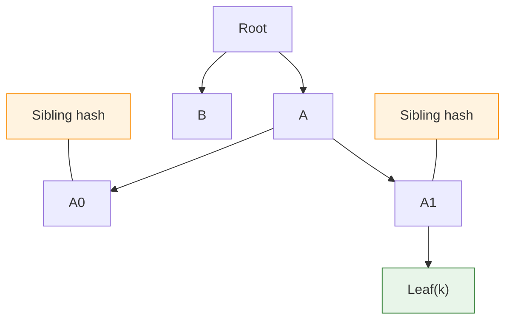

## Encrypted Proofs (Mandatory for `.prf`)
<!-- markdownlint-disable MD033 -->
**Algorithms (HPKE per RFC 9180 profile):**

* KEM: DHKEM(X25519, HKDF-SHA256)
* KDF: HKDF-SHA256
* AEAD: ChaCha20-Poly1305
  
**Request flow:**

Requester generates an ephemeral X25519 key pair and publishes `.prv` including `hpke_pkR` (32-byte public key).

**Response flow:**

Prover derives an HPKE context using `hpke_pkR`, generates `hpke_enc` (32-byte encapsulated pub),
and encrypts the proof payload into `ct`.

**Ciphertext AAD binding:**

* The AEAD additional authenticated data MUST be the deterministic CBOR encoding of the array<br>
  `[peer-pubkey, seq, ver, in_reply_to]`,<br> where `peer-pubkey, seq, ver` are from the envelope and
  `in_reply_to` is from the outer payload.<br><br>
  Rationale: Binding to the envelope identity and correlation ID prevents transplanting the ciphertext
  to a different message.
  Root, count, and cid are protected inside the ciphertext (prf-plaintext)
  and validated post-decryption.

**Verification (requester):**

1. Decapsulate with X25519 private key to obtain AEAD key/nonce, then decrypt `ct` using AAD as above.
2. Check that `kt-responder` equals the envelope peer-pubkey and `kt-in_reply_to` equals the outer in_reply_to and the `.prv` seq.
3. Check that `kt-cid` equals the requested CID from the `.prv`.
4. If `kt-present:
    * `true`: verify the SMT inclusion proof (`kt-proof`) against `kt-root`
    * `false`: verify the non-inclusion proof.

**Non-requesters cannot decrypt and SHOULD ignore `.prf` ciphertext.**
<!-- markdownlint-enable MD033 -->

### Diagram — Encrypted Proof Exchange (.prv/.prf)

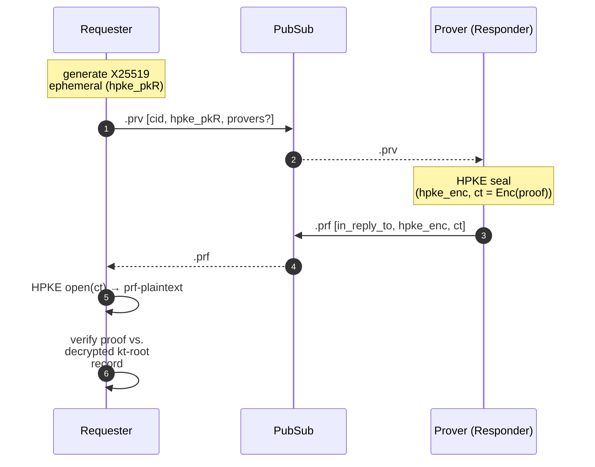

### SMT Proof Encoding

**Proofs use numeric keys with named constants (see CDDL):**

| Index | Name | Type | Description |
| --- | --- | --- | --- |
| 1 | **kp-type** | uint | 0 = inclusion, 1 = non-inclusion |
| 2 | **kp-k** | cidv1 | The document CID (full cidv1). Verifier derives key `k` as the sha2-256 multihash digest embedded in this cidv1 (32 bytes). |
| 3 | **kp-siblings** | array of blake3-256 | Ordered from leaf upward (LSB-first) |
| 4 | **kp-leaf** (OPTIONAL) | blake3-256 | LeafHash; MAY be omitted |
| 5 | **kp-depth** (OPTIONAL) | uint | Defaults to 256 if omitted |

**Note:** kp-k carries the full cidv1 for clarity.

The key `k` used in proof verification is its 32-byte sha2-256 multihash digest.
Implementations MUST also ensure `kp-k` equals the cid carried in the corresponding
`.prv` request; mismatch is invalid.

#### CDDL — SMT proofs

```cddl
smt-proof = {
  kp-type => uint,            ; 0 incl, 1 excl
  kp-k => cidv1,              ; document CID; k = sha2-256 digest from this cidv1
  kp-siblings => [* blake3-256],
  ? kp-leaf => blake3-256,
  ? kp-depth => uint
}

kp-type = 1
kp-k = 2
kp-siblings = 3
kp-leaf = 4
kp-depth = 5

; Blake3 - 256bit digest.
blake3-256 = bytes .size 32 ; BLAKE3-256 output

; IPLD content identifier.
; Currently limited to SHA2-256 based CIDs.
cidv1 = #6.42(bytes .abnfb ("cid" .det cbor-cid ))

; CIDv1 ABNF Constrained for SHA2-256
cbor-cid = '
    cid = cidv1 codec-cbor sha2-256 digest-32 digest
    cidv1 = %x00 %x01
    codec-cbor = %x51
    sha2-256 = %x12
    digest-32 = %x20
    digest = 32(%x00-FF)
'
```

**Verification procedure (inclusion):**

1. Check that `proof.k` (cidv1) equals the requested cid from `.prv` or equals the decrypted `kt-cid`;
   derive `k` as the sha2-256 multihash digest from this cidv1.
2. Compute `LeafHash` using domain separation; iteratively hash with `siblings` per bit of `k` to reconstruct a candidate root.
3. Accept if candidate root equals the decrypted `kt-root`.

**Verification procedure (non-inclusion):**

1. Either demonstrate a path leading to an `Empty` node at divergence depth or
2. provide a neighbor leaf proof whose key differs at the first differing bit.

## Diff Reconciliation

**Objective:** Provide the requester with a complete list of CIDs it may be missing relative to the responder’s advertised snapshot,
  with minimal interaction.

**Flow:**

1. Requester publishes `.syn` with its current `root` and `count` (optionally targeting a specific peer via `to`).
2. Responder computes the set of CIDs the requester may be missing relative to its
   own snapshot (the responder’s current `root`/`count`).
   Exact determination may rely on local indexes and heuristics; under honest assumptions,
   including all responder-held CIDs suffices for convergence.
3. If the list is small (≤ 1 MiB when encoded),
   responder MAY include it inline in `.dif` as `missing_for_requester`.
4. Otherwise, responder assembles a diff manifest (see Diff Manifest)
   encoded with deterministic CBOR,
   stores it in IPFS without pinning,
   and replies on `.dif` with the manifest CID and an intended availability `ttl`.
5. Requester fetches the manifest,
   1. pins and inserts any CIDs it does not already have, and
   2. updates its SMT.

Further `.new` or `.dif` messages will drive it to parity.

**Caching:**

For a given responder snapshot (`root`,`count`), the manifest CID is stable;
responders SHOULD cache and reuse it across solicitations.

**Availability:**

Responders SHOULD keep manifest blocks available for at least `TdiffTTL` seconds (default 3600).
Implementations MAY choose to pin temporarily or serve blocks opportunistically.

**Rate limiting:**
Responders SHOULD apply jitter and MAY suppress replies if another adequate
`.dif` is seen for the same `.syn` to limit redundant manifests.

**Prefix depth:**

Responders SHOULD select an appropriate depth per the .syn rules above to keep per-bucket sizes ≲ 64 while depth ≤ 14.

### Diagram — Prefix Depth Selection

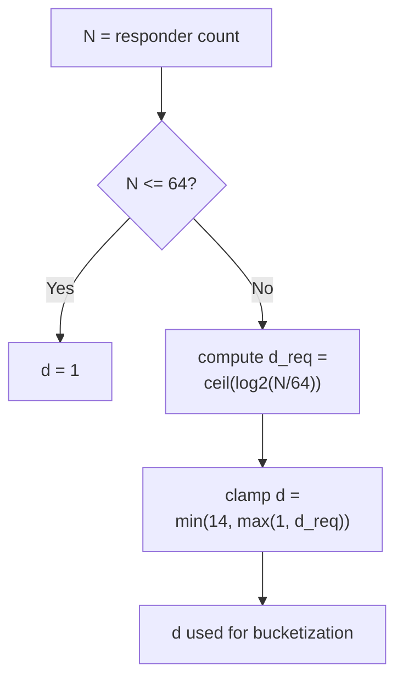

## Diff Manifest (IPFS object)

Use when inline lists would exceed 1 MiB.

The diff manifest is simply an array of cidv1 values encoded with deterministic CBOR.
Ordering: The array MUST be ordered by the documents’ appearance in the responder’s SMT leaves
from left to right (in-order by path),
ensuring a stable manifest CID for a given snapshot.
It carries no metadata; its context and binding come from the `.dif` message that references it (which includes any `ttl`).

### CDDL — Diff manifest

```cddl
diff-manifest = [* cidv1]
cidv1 = bytes .size (36..40)  ; CIDv1 (binary); multihash MUST be sha2-256 (32-byte digest)
```

Example (decoded):

```cbor
[
  h'06f9...cidv1',
  h'07aa...cidv1',
  h'09bc...cidv1'
]
```

## Error Handling

* Invalid signature or CBOR not using deterministic encoding: drop.
* Oversized message: drop.
* Fetch/pin failure: do not insert into SMT; release partial pins from the announcement;
  retain a pending queue and retry within the configured pinning window/policy.

## Security Considerations (PoC)

* Honest participants assumed; messages are public and unauthenticated beyond per-peer signatures,
  except `.prf` proof content which is encrypted end-to-end using HPKE as specified.
* Implementations SHOULD rate-limit `.syn` and `.dif` per peer and bound pin concurrency to avoid resource exhaustion.

## Privacy Considerations (PoC)

* None; all fields are public.
  Future versions may add encryption/signing via COSE.

## Observability and Metrics

* Track: `.new` seen, pins queued/succeeded/failed, roots observed,
  divergence detected, `.syn` sent, `.dif` received,
  diff manifests served/fetched, bytes fetched.
* If proof topics enabled: `.prv` sent/received, `.prf` verified, proof cache hits.

## Interoperability

* Deterministic CBOR encoding is required for all payloads and manifests.
* CIDs MUST be CIDv1;
* CID arrays MUST contain their binary representations.
* PoC CID restriction:
    * Document CIDs MUST be CIDv1 with multihash sha2-256 (32-byte digest).
    * Other multihash functions are not accepted in this version.
* SMT hashing MUST be BLAKE3-256 exactly as specified;
    * mixing hash functions will produce incompatible roots and proofs.

## Extensibility

* New optional fields may be added to payload maps.
* Unknown optional fields MUST be ignored.

## References

* Sparse Merkle Trees: RFC 6962 (conceptual), Cosmos ICS23 (proof encoding inspiration).
* Rust Sparse merkle tree [implementation](https://crates.io/crates/sparse-merkle-tree)
* BLAKE3: O'Connor et al., <https://github.com/BLAKE3-team/BLAKE3> (specification and reference implementations).
* Deterministic CBOR: RFC 8949, Sections 4.2.1–4.2.3 (length-first core deterministic encoding).
  Tags MUST appear only when specified by the CDDL; otherwise tags are omitted.
* CID/multihash: Document CIDs MUST be CIDv1 with multihash sha2-256 (32-byte digest) in this PoC.
  See <https://github.com/multiformats/cid> and <https://github.com/multiformats/multihash>.

## Open Questions

* Numeric defaults (`Tmin/Tmax`, size caps) may be tuned through experimentation.
* Potential future direct-stream optimization for large diffs.

## Glossary

* **CID**: IPFS Content Identifier.
* **CIDv1**: Binary CID version 1; in this spec, multihash MUST be sha2-256 with 32-byte digest.
* **SMT**: Sparse Merkle Tree (append-only presence set over CIDs).
* **Root**: SMT root hash summarizing the entire set.
* **Manifest**: IPFS object (by CID) describing a batch of CIDs or a diff.
* **UUIDv7**: 128-bit, time-ordered unique identifier used as message/correlation id.
* **IPFS**: InterPlanetary File System; content-addressed storage and DHT for block exchange.
* **libp2p**: Modular networking stack used by IPFS (transport, pub/sub, etc.).
* **DHT**: Distributed Hash Table; used for provider records and content discovery.
* **Pub/Sub**: Publish/Subscribe messaging; here via libp2p gossipsub (IPFS pubsub).
* **Gossipsub**: libp2p’s gossip-based pub/sub protocol with topic meshes and scoring.
* **CBOR**: Concise Binary Object Representation; deterministic encoding required in this spec.
* **CDDL**: Concise Data Definition Language; used to specify CBOR structures.
* **HPKE**: Hybrid Public Key Encryption (RFC 9180); used to encrypt `.prf` proofs end-to-end.
* **AEAD**: Authenticated Encryption with Associated Data; used within HPKE for proof ciphertexts.
* **AAD**: Additional Authenticated Data; non-encrypted data bound into AEAD integrity checks.
* **KEM**: Key Encapsulation Mechanism; HPKE’s public-key component (DHKEM(X25519, HKDF-SHA256)).
* **KDF**: Key Derivation Function; HPKE uses HKDF-SHA256.
* **Ed25519**: Edwards-curve digital signature algorithm; used for message signing (64-byte signatures).
* **X25519**: Diffie–Hellman over Curve25519; used for HPKE key exchange.
* **BLAKE3-256**: Hash function used for SMT NodeHash/LeafHash (32-byte output).
* **sha2-256**: Multihash function used inside CIDv1 (32-byte digest) to derive SMT key `k`.
* **ChaCha20-Poly1305**: AEAD cipher used by the HPKE profile in this spec.
* **TTL**: Time To Live; duration responders keep diff manifests available when `manifest` is used.
* **QoS**: Quality of Service; topic separation allows independent prioritization/backpressure per topic.
* **PoC**: Proof of Concept; indicates provisional choices and scope limits for this draft.
