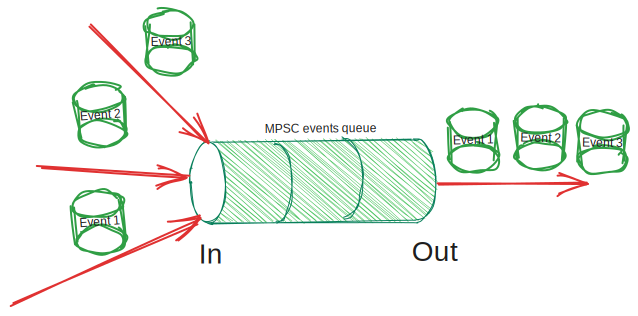

# Hermes events queue implementation

[*Hermes events queue*] it is a simple multi-producers
single-consumer (MPSC) [queue](https://en.wikipedia.org/wiki/Queue_(abstract_data_type)) data structure.
It receives [*Hermes events*] from different [*Hermes runtime extensions*]
and responsible to transport them in corresponding order to the [*Hermes application*].

[*Hermes events*]: ./../../05_building_block_view/hermes_core.md#hermes-event
[*Hermes events queue*]: ./../../05_building_block_view/hermes_core.md#hermes-events-queue
[*Hermes runtime extensions*]: ./../../05_building_block_view/hermes_core.md#hermes-runtime-extension-hre
[*Hermes application*]: ./../../05_building_block_view/hermes_core.md#hermes-application
