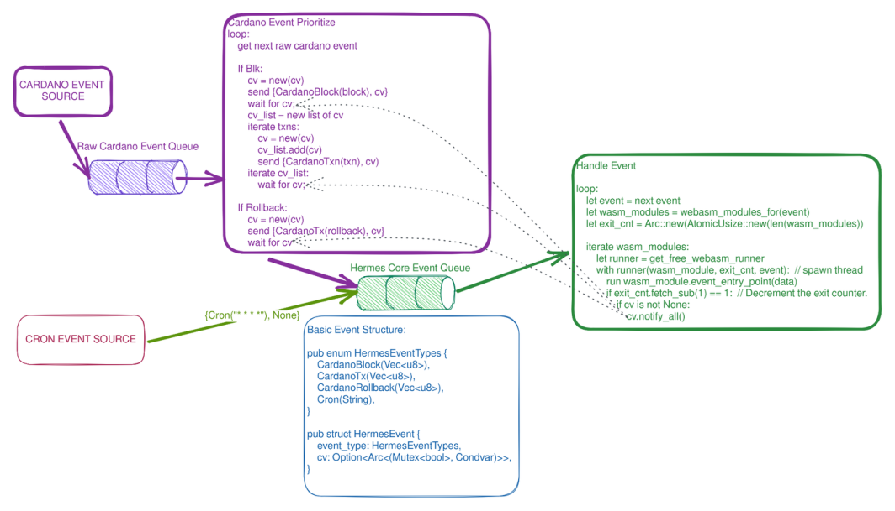

# WASM execution parallelization

Looking for potential optimization,
an obvious solution to parallelize [*Hermes event's*] processing.
One problem with this approach is the possibility of the queue order being disrupted.

Desired properties:

* Any event source can ensure dependent events are fully processed before sending new events.
* Unrelated events are not blocked by another events sources dependencies
* We can have multiple WASM components running concurrently, 1 per CPU core.
* We keep the WASM execution as busy as possible.
* We do not block WASM execution because of dependencies.
* A general solution that can be used by any event source.
* Event sources do not need dependencies where their events do not require earlier complete execution.

## Generalized Dependency Tracking

One of the potential solution

[*Hermes event's*]: ./../../05_building_block_view/hermes_core.md#hermes-event
