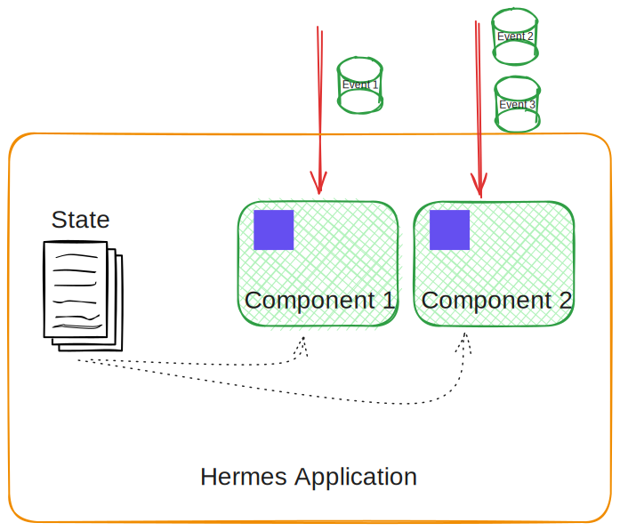
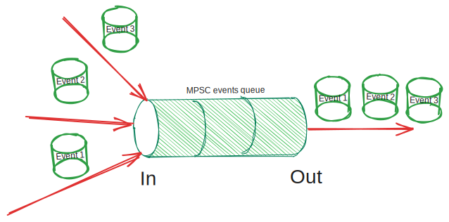
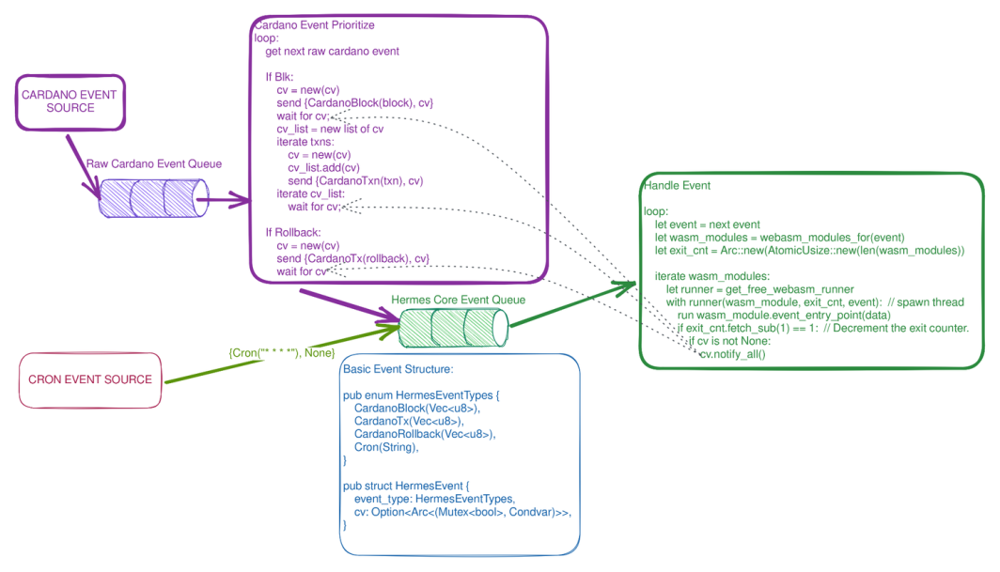

# Cross-cutting Concepts

<!-- See: https://docs.arc42.org/section-8/ -->

<!-- some notes about that  -->

## HRE interface

As it was told before each [*HRE*](../05_building_block_view/hermes_core.md#hermes-runtime-extension-hre) defines a
[WIT](https://component-model.bytecodealliance.org/design/wit.html) file.
It is a 1 on 1 match, so every *HRE* has to have a corresponding WIT file.
It specifies the following important parts:

* *Hermes events* signature, which produced by the corresponding *HRE*.
* *HRE calls* which could invoked by the *Hermes application*.

Example of the WIT file for the [cron](https://en.wikipedia.org/wiki/Cron) *HRE*:

```wit
package hermes:cron;

interface cron-types {
    record cron-tagged {
        /// The crontab entry in standard cron format.
        /// The Time is ALWAYS relative to UTC and does not account for local time.
        /// If Localtime adjustment is required it must be handled by the module.
        when: string,

        /// The tag associated with the crontab entry.
        tag: string
    }
}

interface cron-events {
    use cron-types.{cron-tagged};

    /// Triggered when a cron event fires.
    ///
    /// This event is only ever generated for the application that added
    /// the cron job.
    on-cron: func(event: cron-tagged, last: bool) -> bool;
}

interface cron-calls {
    use cron-types.{cron-tagged};

    /// # Schedule Recurrent CRON event
    ///
    /// Cron events will be delivered to the `on-cron` event handler.
    add: func(entry: cron-tagged, retrigger: bool) -> bool;

    /// # Remove the requested crontab.
    ///
    /// Allows for management of scheduled cron events.
    rm: func(entry: cron-tagged) -> bool;
}

world cron {
  import cron-calls;
  export cron-events;
}
```

*Hermes events*:

* `on-cron: func(event: cron-tagged, last: bool) -> bool`
  
*HRE calls*:

* `add: func(entry: cron-tagged, retrigger: bool) -> bool`
* `rm: func(entry: cron-tagged) -> bool`

## HRE initial setup

To properly setup a *HRE* module a specific configuration file should be provided by the *Hermes application*.
This configuration file is loaded during the *HRE* initialization process
and provides a necessary data to start a specific *HRE* for a specific *Hermes application*.

Each *HRE* defines a JSON schema of the desired configuration for it.
For example for some kind of networking *HRE* module a json schema could look like:

```json
{
    "host": {
      "type": "string"
    },
    "port": {
      "type": "integer"
    },
    "timeout": {
      "type": "integer",
      "minimum": 0
    },
    "maxConnections": {
      "type": "integer",
      "minimum": 1
    },
}
```

## Hermes application structure

[*Hermes application*](./../05_building_block_view//hermes_core.md#hermes-application)
as it was told before it is a collection of compiled
[WASM components](https://component-model.bytecodealliance.org/introduction.html),
[*HRE* config files](#hre-initial-setup)
and some metadata
bundled in [hdf5](https://www.hdfgroup.org/solutions/hdf5/) package.
Each WASM component it is the event handlers implementation of `export` functions from the WIT file, specified by the *HRE*.

Package structure

```bash
├── module1.wasm
├── module2.wasm
├── config.json
└── METADATA
```

## Hermes application execution



Basically, the *Hermes application* is a set of *Hermes event* handler functions and nothing more.
The source code could be split into different WASM components,
but they will have the same state specified for this *Hermes application*.

Application's state initializes during the application initializing process
and mainly based on the configuration of the *HREs* config files.

For each event handling execution,
the application's state remains **consistent** and **immutable**.
It means that before any event processing,
it is made a copy of the initial application's state,
this copy used during the execution and removed after it.
So the overall application state remains the same.

## Hermes events queue implementation



[*Hermes events queue*](./../05_building_block_view/hermes_core.md#hermes-events-queue) it is a simple multi-producers
single-consumer (MPSC) [queue](https://en.wikipedia.org/wiki/Queue_(abstract_data_type)) data structure.
It receives *Hermes events* from different *Hermes runtime extensions*
and responsible to transport them in corresponding order to the *Hermes application*.

## WASM execution parallelization

Looking for potential optimization,
an obvious solution to parallelize *Hermes event's* processing.
One problem with this approach is the possibility of the queue order being disrupted.

Desired properties:

* Any event source can ensure dependent events are fully processed before sending new events.
* Unrelated events are not blocked by another events sources dependencies
* We can have multiple WASM components running concurrently, 1 per CPU core.
* We keep the WASM execution as busy as possible.
* We do not block WASM execution because of dependencies.
* A general solution that can be used by any event source.
* Event sources do not need dependencies where their events do not require earlier complete execution.

### Generalized Dependency Tracking

One of the potential solution


